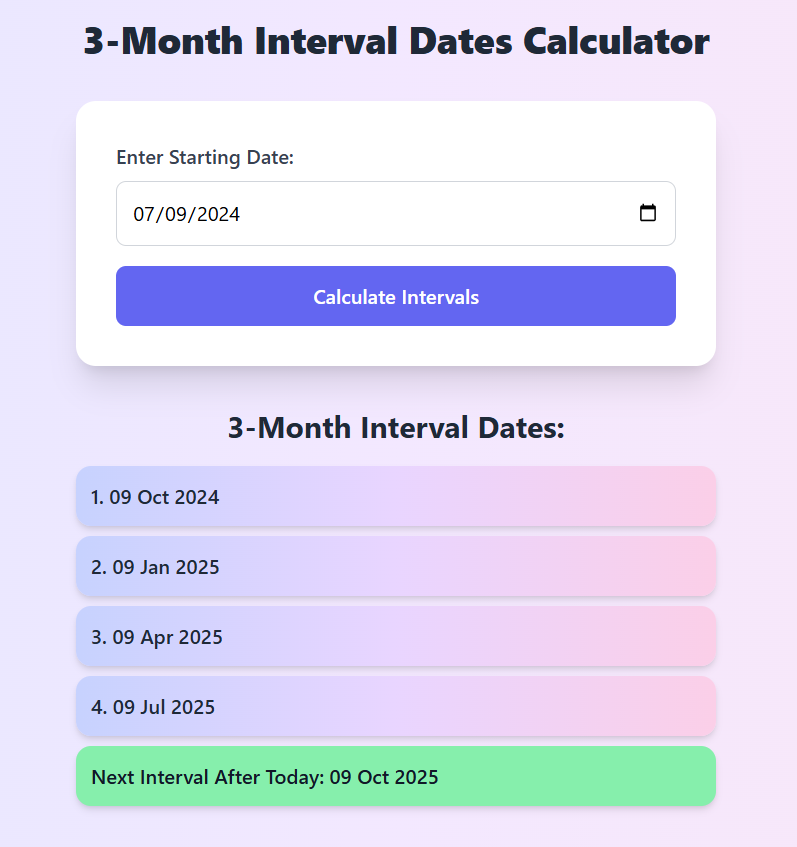

# 3 Month FDR Dates Calculator

A **responsive web page** that calculates 3-month interval dates starting from a user-provided date, displays past intervals up to today, and highlights the next upcoming interval. Built using **HTML, Tailwind CSS, and JavaScript**.

---

## 🌟 Features

- Input a **starting date** using a date picker.
- Calculate **3-month intervals** up to today's date.
- Show the **next 3-month interval after today**.
- Display months in **name format** (e.g., Jan, Feb, Mar).
- Responsive design suitable for **mobile and desktop**.
- Modern UI with **gradient cards and hover effects**.

---

## 🛠 Tech Stack

- **HTML5** – Structure of the page.
- **Tailwind CSS** – Styling and responsiveness.
- **JavaScript** – Date calculations and DOM manipulation.

